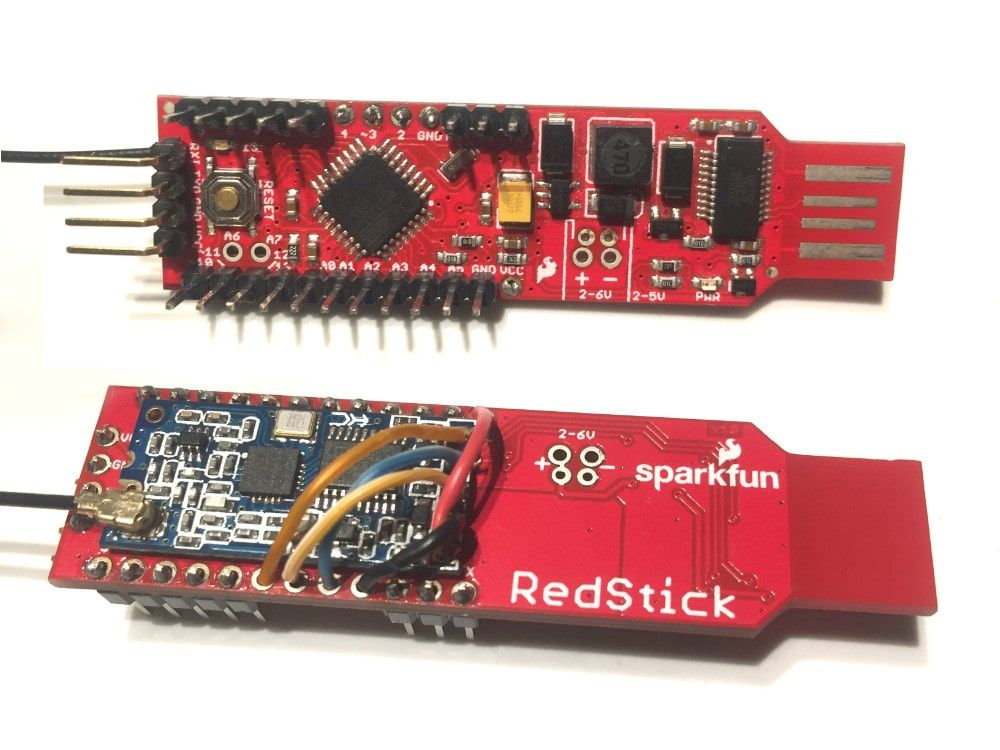
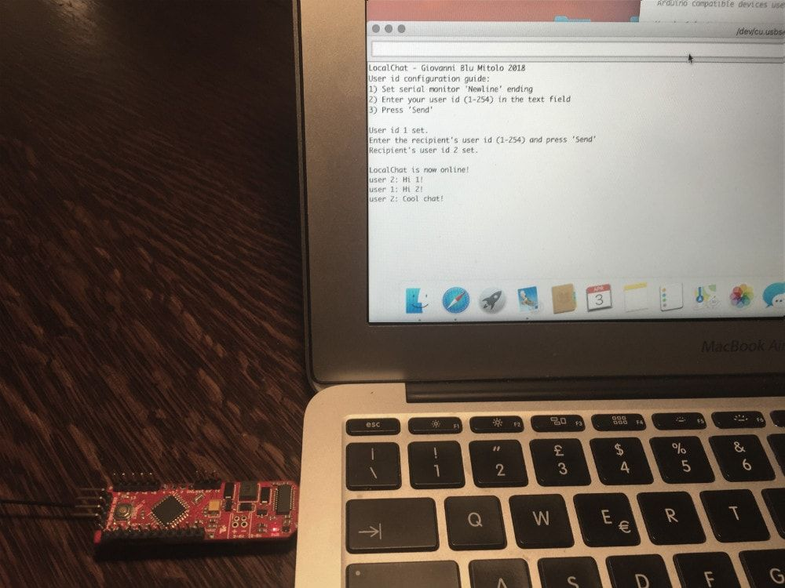

# LocalChat example

The wireless example has been modified to use SoftwareBitBang instead of wireless and Serial.

LocalChat is a wireless instant messaging application example implemented in 170 lines of code. It uses a laptop or a desktop computer and the Arduino IDE serial monitor for the user interface. Connectivity is provided by an Arduino compatible device wired to a HC-12 433MHz wireless module that supports up to 1800m range in ideal conditions. PJON in local mode supports networking for up to 254 unique users or 127 one-to-one conversations. LocalChat is a proof of concept demonstrating how, using PJON and makers' technology, decentralized networking can be easily achieved with interesting implications.

This version is adapted to use SoftwareBitBang over a single wire. John Fletcher 2024.

## Diagram for the wireless version

```cpp  
/* User's 1 laptop                                        User's 2 laptop
  __________________                                     __________________
 ||1:Ciao 2!       ||                                   ||1:Ciao 2!       ||
 ||2:Ciao 1 :)     ||     LOS or line of sight range    ||2:Ciao 1 :)     ||
 ||1:Cool chat!    ||             150-1800m             ||1:Cool chat!    ||
 ||________________||          |             |          ||________________||
 |__________________| USB  ____|__         __|____  USB |__________________|
 |[][][][][][][][][]|=====|ARDUINO|       |ARDUINO|=====|[][][][][][][][][]|
 |[][][][][][][][][]|     | HC-12 |       | HC-12 |     |[][][][][][][][][]|
 |[][][]|____|[][][]|     |_______|       |_______|     |[][][]|____|[][][]|
 |__________________|                                   |__________________|

*/
```

To wirelessly connect n computers (up to 254) you need n Arduino compatible devices and n HC-12 modules. Before experimentation be sure that HC-12 complies with your government's regulations and its use is permitted without the need of a radio amateur license.

The first thing to do is to connect the HC-12 modules to the Arudino compatible devices. The wiring is extremely simple:
- Connect HC-12 TX pin to Arduino pin 2
- Connect HC-12 RX pin to Arduino pin 3
- Connect HC-12 VCC pin to Arduino pin +5v
- Connect HC-12 GND pin to Arduino pin GND

Now connect the Arduino compatible device to the computer's USB. The packet radio can be built using one of the USB enabled Arduino compatible devices like an Arduino Duemilanove, Uno, Nano or Mega. In the picture below a Redstick is used and a HC-12 module is connected as described above to obtain a handy USB packet radio running PJON and LocalChat:


The maximum range detected is around 150m in urban environment without line of sight using the default configuration and standard antenna. It is probably possible to reach more than 500 meters in open area with line of sight. The highest maximum range can be reached reducing the data rate and using a good antenna.

### Set up LocalChat
- Flash the [HC-12-LocalChat](HC-12-LocalChat.ino) example on the Arduino
- Open the Arduino IDE serial monitor at 115200 baud
- Set serial monitor 'Newline' ending
- Enter your user id (1-254) in the text field and press 'Send'
- Enter the recipient's user id (1-254) and press 'Send'

After following the steps described above it is possible to directly chat with the other user simply by typing in the serial monitor's text field and pressing enter. Up to 254 users are supported, communication is completely handled by PJON that is configured to avoid packet duplications by using the packet id feature and to report communication errors that are logged in the interface.



LocalChat is not done to be practical, it is just an example done to showcase how quickly can be deployed an instant messaging application that requires wireless connectivity using PJON, open-hardware and makers' technology without the aid of any third party or the use of a regulated or commercial communication medium. The Arduino compatible device sends and receives serial data to and from the computer's USB port. The Arduino IDE serial monitor is only the most basic option for the user's interface, a dedicated and more graphical executable could be developed.
