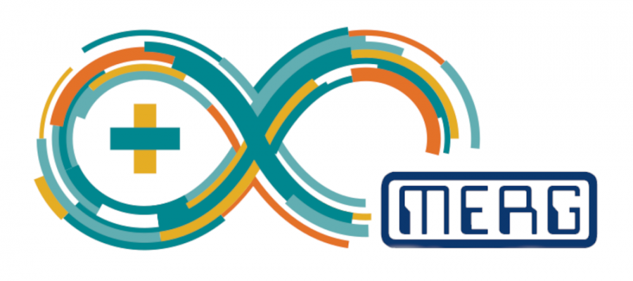

 

# Arduino Signals examples

These are examples of Arduino code using Sven Rosvall's signal code and modifications.

The examples are grouped by signal function.

I am testing some of the examples and adding task management using TaskManagerIO (TM added to file names)

I am controlling the task management with an enum defining the state where this is relevant.

## CANSignals

These examples can link to CBUS.

## Signal2Aspect

These examples work with one two aspect signal.

## Signal3Aspect

These examples work with one three aspect signal. 

Some of these examples - the ones with I2C in the name - need the SignalControlPCA9685Light for operation.

This library has to be downloaded and installed to have the header files FastPCALight.h and SlowPCALight.h available.

## SignalControlPCA9685Light (Library)

This is a library which extends Sven Rosvall's Signal Control Library.

This provides header files so that LEDs can be controlled from a PCA9685 expansion board.

The code in the library needs to be downloaded as a zip file and then installed in your Arduino library folder so that the headers can be accessed.

## Two Signals

These examples work with two signals.

## 3ColourLED

Examples to experiment with 3 colour LEDs.

## SignalComposite

These use the Composite and Observer patterns to combine items.
